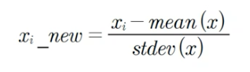
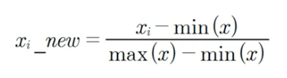

##### 데이터 인코딩 
머신러닝 알고리즘은 문자열 데이터 속성을 입력 받지 않으며 모든 데이터는 숫자형으로 표현 되어야 합니다. 문자형 카테고리형 속성은 숫자값으로 변환/인코딩 되어야 합니다. 

- 레이블 인코딩 
- 원-핫(One-Hot) 인코딩 

##### 레이블 인코딩 
[TV , 냉장고 , 전자렌지 ] => [0 , 1, 4 ] 숫자로 변환됨 
치명적인 단점은 숫자는 서로 관에 연관성이 있는데 아래 예제처럼 이를 무시한다. 가령 0보다 큰 실수는 1  또는 2보다 0 은 크다 (관계성이 있다.)

|제목|가격|
|:------|:---|
|TV|1,000,000|
|냉장고|1,500,000|
|전자렌지|200,00|
Transform () 
|제목|가격|
|:------|:---|
|0|1,000,000|
|1|1,500,000|
|4|200,00|

##### 원한 인코딩 
새로운 차원을 추가한다 피봇후 유효한 피처인지 확인 한다. 
레이블인코딩시 발생하는 연관성에 대한 문제를 해결 할수 있는 좋은 방법이다. 
|상품분류|
|:------|
|TV|
|냉장고|
|전자렌지|
Transform () 
|상품분류_TV|상품분류_냉장고|상품분류_믹서|
|------|------|------|
|0|0|0|
|0|1|0|
|0|0|1|

**원핫 인코딩 처리 절차**
원본데이터 -> 레이블 인코딩 -> 원-핫 인코딩 해준다. 

----
##### 피처 스케일링 
- 표준화 - 데이터의 픽처 각각이 평균이 0이고 분산이 1인 가우시안 정규 분표를 가진값으로 변환하는 것 (비율 유지 X) 

- 정규화 - 서로다른 피처의 크기를 통일하기 위해 크기를 변환해주는 개념입니다.(비율을 유지)


###### scikit Lean Scaler Class 
- StandardScaler : 평균이 0이고, 분산이 1인 정규 분포 형태로 변환
- MinMaxScaler : 데이터값을 0과 1사이의 범위 값으로 변환합니다. (음수값이 있으면 -1에서 1값으로 변환됩니다.)


TODO) 소스리뷰 하기. 


##### 정제 
null 값에 대해서는 삭제및 중간값등 전처리가 필요하며 이에 따라 판다스에서 할수있는 몇몇 기능이 있다.

```python 

```


